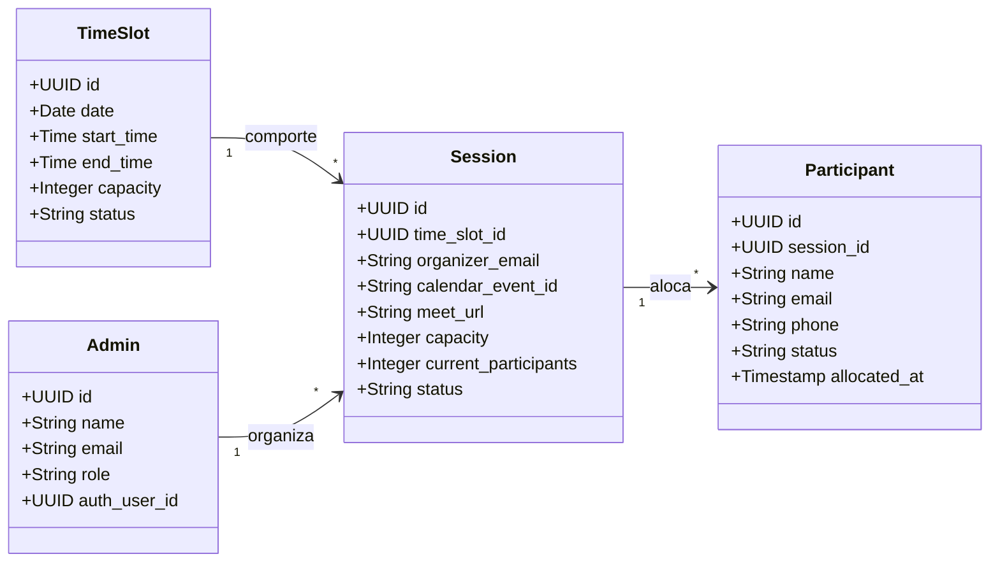
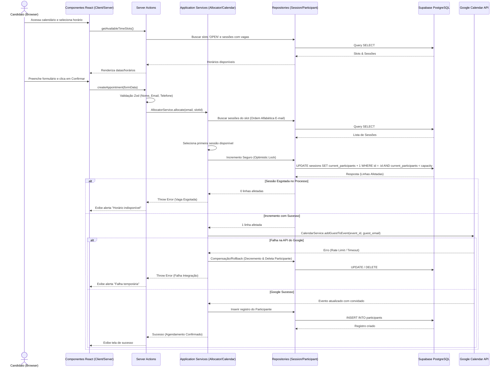

# 001 — Public Scheduling

## Technical Implementation Plan

### Objetivo Técnico

Descrever detalhadamente a implementação da feature de agendamento público (**Public Scheduling**), garantindo o desacoplamento de camadas segundo o padrão **Feature-First**, a utilização segura de **Server Actions** e **Supabase SSR**, a atomicidade nas operações do **Google Calendar API** e o tratamento robusto de concorrência e RLS.

---

# Domain Rules

Todas as operações de negócio devem respeitar estritamente as regras de domínio abaixo descritas:

- **DR-001**: Um `Participant` pertence exatamente a uma `Session`.
- **DR-002**: Uma `Session` pertence exatamente a um `TimeSlot`.
- **DR-003**: Um participante (identificado pelo e-mail) não pode possuir duas reservas confirmadas para o mesmo `TimeSlot`.
- **DR-004**: Apenas `Sessions` com status `'AVAILABLE'` podem receber participantes.
- **DR-005**: Uma `Session` nunca pode ultrapassar sua capacidade física definida (`capacity`).
- **DR-006**: Quando `current_participants` atingir a `capacity`, a `Session` transiciona automaticamente para o status `'FULL'`.
- **DR-007**: Quando todas as `Sessions` vinculadas a um `TimeSlot` estiverem com status `'FULL'`, o `TimeSlot` passa automaticamente para o status `'FULL'`, ocultando-o de novas buscas.
- **DR-008**: `TimeSlots` com datas ou horários passados em relação ao momento da consulta nunca aparecem ao candidato.
- **DR-009**: `Sessions` com status `'CANCELLED'` ou `'FINISHED'` nunca são expostas na interface pública de agendamento.
- **DR-010**: O Google Calendar é a fonte de verdade para a agenda oficial do administrador; o Supabase mantém referências lógicas dos eventos e dos dados locais de participantes.

---

# Domain Diagram

Diagrama de domínio detalhando as relações de cardinalidade entre os agregados:



---

# Status Oficiais

Mapeamento de status e condições de transições de estados para as entidades:

## SessionStatus

- **`AVAILABLE`**: A sessão está aberta para novos agendamentos (`current_participants < capacity`).
- **`FULL`**: A sessão atingiu a capacidade máxima (`current_participants = capacity`). Ocorre quando a última vaga é confirmada.
- **`FINISHED`**: A entrevista/dinâmica foi concluída (marcado manualmente ou via rotina após a data do slot).

## TimeSlotStatus

- **`OPEN`**: O horário possui pelo menos uma sessão relacionada com status `AVAILABLE`.
- **`FULL`**: Todas as sessões vinculadas a este slot atingiram a capacidade. Ocorre imediatamente após a transição da última sessão para `FULL`.
- **`CLOSED`**: O slot foi fechado ou removido pelo administrador via painel.

---

# Arquitetura

O fluxo de agendamento público opera de forma totalmente desacoplada, separando a interface do usuário das integrações com APIs externas e persistência:



### Limites entre Camadas

1. **Interface (UI)**: Componentes React que exibem estados de loading, sucesso, calendário e formulários. Não contêm lógica SQL ou chamadas diretas a APIs de terceiros.
2. **Server Actions**: Porta de entrada do servidor. Responsável pela validação de entrada (Zod), controle de transação lógica e tratamento genérico de erros.
3. **Application Services**: Orquestrador de negócio. Decide qual sessão alocar (round-robin alfabético) e gerencia o fluxo de rollback compensatório em caso de falha externa.
4. **Repositories**: Camada exclusiva de persistência. Contém as chamadas ao Supabase usando tipagem estática gerada (`Database`).

---

# Estrutura de Pastas

Os seguintes arquivos serão criados ou estendidos no monorepo para acomodar a feature:

```text
apps/web/src/
├── app/
│   └── (public)/
│       └── scheduling/
│           └── page.tsx               # [NEW] Página pública de agendamento (SSR para calendário inicial)
├── features/
│   └── scheduling/
│       ├── actions/
│       │   ├── create-appointment.ts  # [NEW] Server Action para processar o formulário de reserva
│       │   └── get-available-slots.ts # [NEW] Server Action para buscar horários dinâmicos
│       ├── components/
│       │   ├── calendar-selector.tsx  # [NEW] Grid de seleção de dias e horários
│       │   ├── scheduling-form.tsx    # [NEW] Formulário de dados do candidato (Client Component)
│       │   └── feedback-screen.tsx    # [NEW] Telas de feedback de sucesso, erro e lotação
│       ├── repositories/
│       │   ├── time-slot.repository.ts # [NEW] Repositório para tabelas public.time_slots
│       │   └── session.repository.ts  # [NEW] Repositório para tabelas public.sessions
│       ├── services/
│       │   └── allocation.service.ts  # [NEW] Algoritmo de alocação de sessões (Heurística alfabética)
│       ├── validators/
│       │   └── appointment.validator.ts # [NEW] Esquema Zod de validação dos dados de entrada
│       └── index.ts
├── shared/
│   └── services/
│       └── google-calendar.service.ts # [NEW] Chamadas para a Google Calendar API (adicionar convidados)
```

---

# Fluxo de Dados

1. **Request**: O candidato preenche o formulário e envia via Server Action (`createAppointment`).
2. **Validação**: O esquema Zod analisa a entrada (e-mail, nome, telefone). Validações regex são aplicadas. Em caso de erro, retorna falha imediatamente.
3. **Bloqueio Concorrente**: O serviço de alocação determina a sessão correta (ordem alfabética dos e-mails dos organizadores) e executa o `UPDATE` condicional no banco de dados.
4. **Integração Google**: O backend consome as credenciais e adiciona o e-mail do participante como convidado no evento correspondente no Google Calendar.
5. **Persistência**: Em caso de sucesso do Google, insere o registro na tabela `public.participants` e confirma a transação.
6. **Resposta / Atualização**: A UI transiciona do estado `isPending` para a tela de sucesso ou exibe mensagens de falha específicas.

---

# Modelos

### 1. TimeSlot

- **Origem**: Banco de dados (`public.time_slots`).
- **Relacionamento**: Possui relação `1:N` com `public.sessions`.
- **Dependências**: Data e horários base da agenda do administrador.

### 2. Session

- **Origem**: Banco de dados (`public.sessions`).
- **Relacionamento**: Pertence a um `TimeSlot` (`N:1`) e possui relação `1:N` com `public.participants`.
- **Dependências**: Depende de um organizador (email cadastrado em `public.admins`).

### 3. Participant

- **Origem**: Banco de dados (`public.participants`).
- **Relacionamento**: Pertence a uma `Session` (`N:1`).
- **Dependências**: E-mail, telefone e nome informados pelo candidato.

---

# Contracts

Assinatura estrita dos métodos expostos pelas Server Actions e camadas de integração:

## `getAvailableTimeSlots`

- **Input**: `void`
- **Output**:
  ```ts
  {
    success: boolean
    slots?: Array<{
      id: string
      date: string
      start_time: string
      end_time: string
    }>
    error?: string
  }
  ```

## `createAppointment`

- **Input**:
  ```ts
  {
    name: string;
    email: string;
    phone: string;
    timeSlotId: string;
  }
  ```
- **Output**:
  ```ts
  {
    success: boolean
    participantId?: string
    sessionId?: string
    error?: {
      code: string
      message: string
    }
  }
  ```

---

# Server Actions

### 1. `getAvailableTimeSlots`

- **Responsabilidade**: Retornar as datas e horários dos slots com status `'OPEN'` e que possuam vagas remanescentes.
- **Parâmetros**: Nenhum (ou range de datas opcional).
- **Retorno**: Lista estruturada contendo `id`, `date`, `start_time` e `end_time`.
- **Tratamento de Erros**: Em caso de erro de consulta, retorna uma lista vazia e loga o erro técnico.

### 2. `createAppointment`

- **Responsabilidade**: Validar dados, buscar e alocar sessão, inserir participante no banco e na API do Google.
- **Parâmetros**: `name: string`, `email: string`, `phone: string`, `timeSlotId: string`.
- **Retorno**: Objeto de sucesso `{ success: true }` ou erro `{ success: false, errorType: string }`.
- **Tratamento de Erros**: Captura erros de concorrência, e-mail duplicado e falha de API, executando rollback lógico e retornando erro amigável.

---

# Services

### 1. `AllocationService`

- **Responsabilidade**: Localizar a sessão adequada no `TimeSlot` selecionado.
- **Algoritmo**: Filtra sessões ativas com `current_participants < capacity`, ordena por `organizer_email` alfabeticamente e escolhe a primeira.
- **Comunicação**: Chama o `SessionRepository` para checagem e incremento, e o `GoogleCalendarService` para a inserção do convidado.

### 2. `GoogleCalendarService`

- **Responsabilidade**: Integrar com a API REST do Google Calendar para inserir um novo e-mail no array `attendees` de um evento existente (`calendar_event_id`).
- **Comunicação**: Chamado exclusivamente pelo `AllocationService` sob o contexto do servidor.

---

# Repositories

### 1. `TimeSlotRepository`

- **Consultas**:
  - `selectAvailableSlots`: Busca slots de data futura com status `'OPEN'`.

### 2. `SessionRepository`

- **Consultas**:
  - `findAvailableSessionsBySlot`: Busca sessões ativas associadas a um `time_slot_id`.
  - `incrementParticipantsSecure`: Executa a query atômica de incremento com trava de concorrência (`current_participants < capacity`).
  - `decrementParticipants`: Decrementa a capacidade de uma sessão em caso de rollback.

### 3. `ParticipantRepository`

- **Consultas**:
  - `insertParticipant`: Salva o registro do candidato na tabela `public.participants`.
  - `checkDuplicate`: Checa se já existe um participante confirmado com o mesmo e-mail para o mesmo `time_slot_id`.

---

# Componentes React

- **Page**: `apps/web/src/app/(public)/scheduling/page.tsx` (Root Server Component).
- **CalendarGrid**: Visualização de calendário mensal/semanal para escolha de datas.
- **TimePicker**: Lista de horários disponíveis dinamicamente para o dia selecionado.
- **SchedulingForm**: Formulário para captura de dados do candidato.
- **FeedbackScreen**:
  - **SuccessState**: Mensagem de agendamento confirmado e instruções sobre o e-mail recebido.
  - **ErrorState**: Alertas de erros genéricos ou de preenchimento.
  - **SlotFullState**: Alerta quando a vaga é ocupada antes do envio.

---

# Validações

### Esquema Zod (`appointmentSchema`)

- **`name`**: `z.string().min(3, "O nome deve ter no mínimo 3 caracteres").max(100)`
- **`email`**: `z.string().email("Endereço de e-mail inválido")`
- **`phone`**: `z.string().regex(/^\(?\d{2}\)?\s?\d{4,5}-?\d{4}$/, "Telefone no formato inválido (XX) 9XXXX-XXXX")`

### Validações de Negócio

- Impedir múltiplos agendamentos para o mesmo e-mail no mesmo `time_slot_id`.
- Validar se a data selecionada é futura.

---

# Tratamento de Concorrência

1. **Prevenção de Overbooking**: Realizada pelo `UPDATE` condicional no banco de dados. Caso o retorno de registros atualizados seja `0`, assume-se que o limite foi atingido simultaneamente por outro request.
2. **Rollback Técnico**: Se a API do Google falhar após o incremento com sucesso no banco de dados, o `AllocationService` dispara uma query de compensação para decrementar o valor de `current_participants` no banco de dados, retornando o estado anterior de forma íntegra.

---

# Error Catalog

Erros mapeados e padronizados para consistência e tratamento uniforme:

| Código      | Descrição                                            | HTTP Status             | Origem                  | Mensagem para UI                                          |
| ----------- | ---------------------------------------------------- | ----------------------- | ----------------------- | --------------------------------------------------------- |
| **APP-001** | E-mail do participante em formato inválido           | 400 Bad Request         | Validação Zod           | "O e-mail digitado não é válido."                         |
| **APP-002** | Telefone ou Nome com tamanho/caracteres inválidos    | 400 Bad Request         | Validação Zod           | "Por favor, verifique os campos do formulário."           |
| **APP-003** | Agendamento duplicado no mesmo TimeSlot              | 409 Conflict            | `ParticipantRepository` | "Você já possui um agendamento para este horário."        |
| **APP-004** | A última sessão disponível para o slot esgotou       | 409 Conflict            | `SessionRepository`     | "Este horário acabou de lotar. Por favor, escolha outro." |
| **APP-005** | Falha na API do Google Calendar durante transação    | 503 Service Unavailable | `GoogleCalendarService` | "Não foi possível gerar seu convite. Tente novamente."    |
| **APP-006** | Erro inesperado do servidor / Banco de dados offline | 500 Internal Error      | Qualquer camada         | "Ocorreu um erro interno. Tente mais tarde."              |

---

# Tratamento de Erros

| Origem                        | Comportamento na UI            | Mensagem do Erro                                       | Ação de Recuperação                             |
| ----------------------------- | ------------------------------ | ------------------------------------------------------ | ----------------------------------------------- |
| Validação de formulário (Zod) | Alerta no campo correspondente | Ex: "Endereço de e-mail inválido"                      | Correção de digitação do usuário                |
| E-mail Duplicado no Slot      | Modal/Alerta vermelho          | "Você já possui um agendamento para este horário."     | Sugerir outro horário ou login                  |
| Concorrência de Vaga          | Modal informativo              | "Este horário acabou de esgotar."                      | Redirecionar para o calendário                  |
| Falha Google Calendar API     | Tela de Erro                   | "Não foi possível gerar seu convite. Tente novamente." | Executa Rollback no DB e permite tentar de novo |
| Falha de Conexão DB           | Tela de Erro Geral             | "Serviço temporariamente indisponível."                | Loga o erro e pede re-tentativa posterior       |

---

# Non Functional Requirements

Requisitos não-funcionais que determinam o comportamento operacional da funcionalidade:

| Categoria              | Requisito / SLA                                              | Rationale                                                                 |
| ---------------------- | ------------------------------------------------------------ | ------------------------------------------------------------------------- |
| **Tempo de Resposta**  | < 1.5s para carregamento do calendário inicial               | Melhorar LCP e UX em conexões móveis.                                     |
| **Disponibilidade**    | 99.9% de uptime para a página pública                        | Garantir acesso constante a candidatos sem barreiras.                     |
| **Timezone Oficial**   | `America/Sao_Paulo` (Brasília, UTC-3)                        | Fixado no servidor Next.js e indicado no cabeçalho do formulário.         |
| **Idioma**             | Português (pt-BR)                                            | Idioma principal do ecossistema e formulários.                            |
| **Resiliência**        | Rollback transacional atômico                                | Evitar registros sem e-mail correspondente no Google Calendar.            |
| **Limite Concorrente** | Suporte a 50 transações concorrentes simultâneas por segundo | Suportar picos de agendamento durante lançamentos de processos seletivos. |

---

# Segurança

- **Server-Side Exclusivity**: Toda a lógica de comunicação com a API do Google e controle de chaves do Supabase Admin é executada do lado do servidor (Server Actions / Services), isolando tokens e segredos do cliente.
- **Validação de Entrada**: Toda entrada de dados é higienizada e submetida a parse via Zod antes de qualquer inserção no banco de dados.
- **RLS**: As tabelas de produção permanecem protegidas por RLS. As buscas de horários utilizam o cliente seguro. Somente as queries de bootstrap/registro do participante bypassam RLS via `supabaseAdmin` onde estritamente necessário.

---

# Performance

- **SSR (Server-Side Rendering)**: As datas disponíveis iniciais serão pré-renderizadas no servidor no carregamento da página pública para maximizar performance de SEO e tempo de interação (LCP).
- **Caching Dinâmico**: Resultados de busca de horários podem ser cacheados em nível de request utilizando hooks de revalidação de tags do Next.js.
- **Lazy Loading**: O formulário de agendamento e modais de feedback serão importados de forma dinâmica para reduzir o tamanho do bundle principal inicial.

---

# Observabilidade

Logs estruturados e eventos chave para rastreabilidade de transações:

## Eventos de Log Mapeados

- **Reserva Criada**:
  - `console.info` | `[SCHEDULING] Appointment created successfully` | `email`, `timeSlotId`, `sessionId`, `timestamp`
- **Sessão Lotada (Auto-Full)**:
  - `console.info` | `[SCHEDULING] Session state transitioned to FULL` | `sessionId`, `timestamp`
- **Slot Lotado (Auto-Full)**:
  - `console.info` | `[SCHEDULING] TimeSlot state transitioned to FULL` | `timeSlotId`, `timestamp`
- **Rollback Executado**:
  - `console.warn` | `[SCHEDULING] Compensating rollback executed` | `email`, `sessionId`, `timestamp`
- **Falha Google Calendar**:
  - `console.error` | `[SCHEDULING] Google Calendar API request failed` | `eventId`, `error`, `timestamp`
- **Erro Inesperado**:
  - `console.error` | `[SCHEDULING] Unexpected error during scheduling process` | `error`, `timestamp`

---

# Métricas

Indicadores chave de desempenho (KPIs) para monitoramento futuro:

- **Volume de Reservas**: Total de participantes cadastrados com status `'CONFIRMED'` acumulados por dia/semana.
- **Taxa de Ocupação**: Razão entre vagas preenchidas (`current_participants`) e capacidade total (`capacity`) por TimeSlot.
- **Taxa de Falhas no Google**: Número absoluto de erros `APP-005` (API do Google) divididos pelo total de tentativas.
- **Tempo Médio de Confirmação**: Tempo de resposta do Servidor entre o envio do formulário e o carregamento do `SuccessState`.
- **Conversão de Reservas**: Porcentagem de usuários que acessam a página e concluem o preenchimento do agendamento.

---

# Estratégia de Testes

### 1. Testes Unitários

- **Objetivo**: Validar a lógica de ordenação e alocação do `AllocationService` (garantir round-robin alfabético por email).
- **Mocks**: Mock do `SessionRepository`.

### 2. Testes de Integração

- **Objetivo**: Validar a consistência e rollback do fluxo transacional simulando falhas na API do Google Calendar.
- **Cenário**: Chamar `createAppointment`, forçar erro na chamada do Google e testar se os dados no Supabase foram desfeitos.

### 3. Testes E2E

- **Objetivo**: Simular fluxo completo do candidato preenchendo dados e confirmando agendamento com validação visual da página.

---

# QA Checklist

Checklist de cenários de teste manuais para validação antes de merge em produção:

- [ ] **Reserva Normal**: Candidato preenche dados válidos e recebe o e-mail de convite com o link do Google Meet em produção.
- [ ] **Sessão Cheia**: Concluir o agendamento de uma vaga em uma sessão prestes a lotar e validar a transição automática da sessão para `'FULL'`.
- [ ] **Slot Cheio**: Preencher a última vaga da última sessão do TimeSlot e garantir que o slot mude para `'FULL'` e desapareça da lista pública.
- [ ] **E-mail Duplicado**: Tentar cadastrar o mesmo e-mail duas vezes no mesmo TimeSlot e validar o bloqueio `APP-003`.
- [ ] **Falha de API do Google**: Interromper rede/forçar erro na chamada do Google e atestar se os dados do Supabase voltaram ao estado íntegro e a UI exibiu o erro de forma clara.
- [ ] **Concorrência Simultânea**: Efetuar dois submits em paralelo na última vaga e certificar que apenas um participante é cadastrado (impedindo o overbooking).
- [ ] **Responsividade**: Validar a experiência de seleção e preenchimento de formulário no celular (iOS/Android) e telas de Desktop.

---

# Plano de Implementação

### RC-1: Camada de Dados e Repositórios

- **Objetivo**: Criar e testar queries de busca de slots, inserção de participantes e update condicional de sessões.
- **Arquivos**: `time-slot.repository.ts`, `session.repository.ts`, `participant.repository.ts`.
- **Critério de Aceite**: Queries compilando e testadas unitariamente com sucesso.

### RC-2: Services e Integração Google

- **Objetivo**: Construir a lógica de alocação de sessões e o cliente de convite do Google Calendar.
- **Arquivos**: `allocation.service.ts`, `google-calendar.service.ts`.
- **Critério de Aceite**: Teste de integração simulando erro do Google executando rollback com sucesso.

### RC-3: Server Actions e Validações

- **Objetivo**: Expor as funções ao frontend com validações Zod e controle de erros estruturados.
- **Arquivos**: `create-appointment.ts`, `get-available-slots.ts`, `appointment.validator.ts`.
- **Critério de Aceite**: Actions executadas com sucesso a partir de testes estáticos.

### RC-4: UI e Componentes

- **Objetivo**: Desenvolver telas de calendário, formulário e feedbacks de erro/sucesso.
- **Arquivos**: `page.tsx`, `calendar-selector.tsx`, `scheduling-form.tsx`, `feedback-screen.tsx`.
- **Critério de Aceite**: Fluxo visual completo funcional e responsivo.

---

# Checklist Técnico

- [ ] Repository de TimeSlot, Session e Participant criados.
- [ ] Zod schema de validação estruturado.
- [ ] Query condicional de incremento de participantes implementada.
- [ ] Lógica de round-robin alfabético de organizadores implementada e testada.
- [ ] Google Calendar integration estruturada para adicionar convidados.
- [ ] Lógica de rollback/compensação para falhas da API implementada.
- [ ] Componente visual de calendário responsivo desenvolvido.
- [ ] Tratamento de concorrência e feedbacks visuais em tempo real validados.
- [ ] Build e typechecks globais validados.

---

# Definition of Done Técnico

A feature será considerada concluída quando:

- Todos os RCs estiverem implementados.
- A build e o typecheck do Next.js passarem sem avisos ou erros.
- A cobertura de testes unitários do serviço de alocação for de no mínimo 90%.
- O fluxo de rollback for validado manualmente e via testes automatizados de integração.

---

# Riscos Técnicos

| Risco                                            | Impacto | Mitigação                                                                                         |
| ------------------------------------------------ | ------- | ------------------------------------------------------------------------------------------------- |
| Latência na chamada da Google Calendar API       | Médio   | Exibição de skeleton/loading ativo na UI durante processamento.                                   |
| Rate Limits na API do Google em picos de acessos | Alto    | Uso eficiente de sessões compartilhadas e logs de alerta imediatos.                               |
| Inconsistências de fuso horário                  | Alto    | Fixar o processamento do servidor e exibição pública estritamente em `America/Sao_Paulo` (UTC-3). |

---

# Dependências

- Integração Google Cloud OAuth configurada (Sprint 1).
- Supabase instanciado com tabelas iniciais (Sprint 1).

---

# Autoavaliação

- **Clareza**: 5/5
- **Arquitetura**: 5/5
- **Escalabilidade**: 5/5
- **Segurança**: 5/5
- **Testabilidade**: 5/5
- **Observabilidade**: 5/5
- **Manutenibilidade**: 5/5
- **Prontidão para Implementação**: 5/5

---

# RC-1.1 Technical Task Breakdown — Operational Plan

## RC-1 Overview

O objetivo técnico do **RC-1 — Camada de Dados e Repositórios** é estabelecer de forma isolada, tipada e segura a persistência e as consultas do domínio de agendamento público no Supabase PostgreSQL. Esta camada é a fundação para os serviços e Server Actions subsequentes.

---

## Escopo

### O que entra:

- Criação e validação da estrutura de diretórios para repositórios na feature `features/scheduling/repositories/`.
- Definição das interfaces dos repositórios para abstração de dependências.
- Implementação física de `TimeSlotRepository`, `SessionRepository` e `ParticipantRepository`.
- Escrita de testes automatizados de integração específicos para as queries do banco.
- Execução e aprovação estática do código (Lint, Typecheck e Build).

### O que não entra:

- Lógica de negócio e orquestração de alocação (services).
- Conexão e disparo de requisições à API do Google Calendar.
- Lógica de Server Actions e exposição de endpoints.
- Telas, botões, modais ou qualquer renderização visual de UI.

---

## Ordem de Implementação

### Task 01: Setup Directory Structure & Types Verification

- **Objetivo**: Garantir que as pastas existam e as definições de tipo geradas pelo Supabase CLI estejam 100% íntegras com os esquemas físicos das tabelas.
- **Critério de Aceite**: Diretórios criados. Execução bem sucedida do typecheck geral sem erros relacionados a `database.ts`.
- **Arquivos Envolvidos**:
  - Criar: `apps/web/src/features/scheduling/repositories/.gitkeep` (ou diretório direto)
  - Não alterar: `apps/web/src/shared/types/database.ts`
- **Dependências**: Nenhuma.
- **Estimativa**: 1h.

---

### Task 02: Implement Repository Interfaces

- **Objetivo**: Criar contratos abstratos para desacoplar a camada de negócio das chamadas brutas ao Supabase.
- **Critério de Aceite**: Arquivo de tipos/interfaces exportando os métodos exigidos no plano técnico (`findByEmail`, `incrementParticipantsSecure`, etc.) compilando perfeitamente.
- **Arquivos Envolvidos**:
  - Criar: `apps/web/src/features/scheduling/repositories/interfaces.ts`
- **Dependências**: Task 01.
- **Estimativa**: 2h.

---

### Task 03: Implement TimeSlotRepository

- **Objetivo**: Codificar a classe responsável por buscar os horários disponíveis futuros.
- **Critério de Aceite**: Executa query de seleção retornando apenas slots futuros com status `'OPEN'` e que possuam vagas disponíveis.
- **Arquivos Envolvidos**:
  - Criar: `apps/web/src/features/scheduling/repositories/time-slot.repository.ts`
- **Dependências**: Task 02.
- **Estimativa**: 3h.

---

### Task 04: Implement SessionRepository (Optimistic Lock)

- **Objetivo**: Codificar a busca de sessões associadas a um slot e a lógica atômica de incremento/decremento de capacidade.
- **Critério de Aceite**:
  - O método de incremento deve usar `AND current_participants < capacity` no update físico.
  - Retorna `true` se 1 linha foi atualizada, e `false` (ou 0 linhas) se a sessão já estava esgotada.
- **Arquivos Envolvidos**:
  - Criar: `apps/web/src/features/scheduling/repositories/session.repository.ts`
- **Dependências**: Task 03.
- **Estimativa**: 4h.

---

### Task 05: Implement ParticipantRepository (Duplication Safety)

- **Objetivo**: Codificar a criação do participante e a validação preventiva de e-mail duplicado para o mesmo TimeSlot.
- **Critério de Aceite**:
  - Método `checkDuplicate` verifica se já existe registro com status `'CONFIRMED'` para o e-mail e slot ID fornecidos.
- **Arquivos Envolvidos**:
  - Criar: `apps/web/src/features/scheduling/repositories/participant.repository.ts`
- **Dependências**: Task 04.
- **Estimativa**: 3h.

---

### Task 06: Data Layer Integration Tests

- **Objetivo**: Escrever cobertura de testes integrados que instanciem os repositórios contra a conexão real (ou mockada) do Supabase para provar o sucesso das queries.
- **Critério de Aceite**: Teste unitário e de integração finaliza com sucesso (`100% passing tests`).
- **Arquivos Envolvidos**:
  - Criar: `apps/web/src/features/scheduling/repositories/__tests__/repositories.test.ts`
- **Dependências**: Task 05.
- **Estimativa**: 4h.

---

## Dependências entre tarefas

```text
Task 01 (Setup)
     │
     ▼
Task 02 (Interfaces)
     │
     ▼
Task 03 (TimeSlotRepository)
     │
     ▼
Task 04 (SessionRepository)
     │
     ▼
Task 05 (ParticipantRepository)
     │
     ▼
Task 06 (Integration Tests)
```

---

## Arquivos Impactados por Task

### Task 01: Setup Directory Structure

- **Criar**: `apps/web/src/features/scheduling/repositories/`
- **Não alterar**: `shared/types/database.ts`

### Task 02: Implement Interfaces

- **Criar**: `apps/web/src/features/scheduling/repositories/interfaces.ts`

### Task 03: TimeSlotRepository

- **Criar**: `apps/web/src/features/scheduling/repositories/time-slot.repository.ts`

### Task 04: SessionRepository

- **Criar**: `apps/web/src/features/scheduling/repositories/session.repository.ts`

### Task 05: ParticipantRepository

- **Criar**: `apps/web/src/features/scheduling/repositories/participant.repository.ts`

### Task 06: Integration Tests

- **Criar**: `apps/web/src/features/scheduling/repositories/__tests__/repositories.test.ts`

---

## Estratégia de Testes do RC-1

- **Testes Unitários / Mocks**: Validar que os inputs passados às funções geram as chamadas corretas do cliente do Supabase.
- **Testes de Integração**: Validar a query condicional da concorrência na tabela `sessions` (simular múltiplos updates concorrentes e verificar se apenas o número correto de vagas é preenchido).
- **Validação de Build**: Executar `pnpm build` e `pnpm typecheck` no monorepo para garantir que a inclusão das classes não quebre o bundler.

---

## Checklist Operacional

- [ ] Task 01: Diretórios criados e tipagens verificadas.
- [ ] Task 02: Interfaces e contratos de persistência criados.
- [ ] Task 03: `TimeSlotRepository` implementado.
- [ ] Task 04: `SessionRepository` com suporte a Optimistic Lock implementado.
- [ ] Task 05: `ParticipantRepository` com verificação de duplicidade implementado.
- [ ] Task 06: Testes automatizados do RC-1 passando com sucesso.
- [ ] Build e Lint de validação globais aprovados.

---

## Riscos Técnicos do RC-1

| Task        | Risco                                                     | Impacto | Mitigação                                                                                                           |
| ----------- | --------------------------------------------------------- | ------- | ------------------------------------------------------------------------------------------------------------------- |
| **Task 04** | Erro de concorrência ou deadlocks em picos de agendamento | Alto    | Cláusula de update atômico condicional e tratamento no retorno do número de linhas alteradas.                       |
| **Task 06** | Teste de integração falhar por falta de ambiente ativo    | Médio   | Utilização de mocks locais para o cliente do Supabase nos testes unitários ou base de dados de homologação isolada. |

---

## Ordem Recomendada de Commits

1. `feat(scheduling): setup repository directories and define contracts` (Tasks 01 & 02)
2. `feat(scheduling): implement TimeSlotRepository queries` (Task 03)
3. `feat(scheduling): implement SessionRepository with optimistic locking` (Task 04)
4. `feat(scheduling): implement ParticipantRepository with duplication validation` (Task 05)
5. `test(scheduling): add integration tests for repositories queries` (Task 06)

---

## Resultado Esperado

Ao final da execução do **RC-1**:

- Toda a camada de persistência para agendamento público estará concluída.
- Os repositórios estarão exportados e com testes válidos.
- Nenhuma lógica de negócios dos services estará implementada.
- O build global do monorepo e typecheck continuarão passando com sucesso absoluta (0 erros).

---

## Autoavaliação do Planejamento do RC-1

- **Clareza**: 5/5
- **Sequenciamento**: 5/5
- **Granularidade das Tasks**: 5/5
- **Testabilidade**: 5/5
- **Manutenibilidade**: 5/5
- **Prontidão para Implementação**: 5/5
