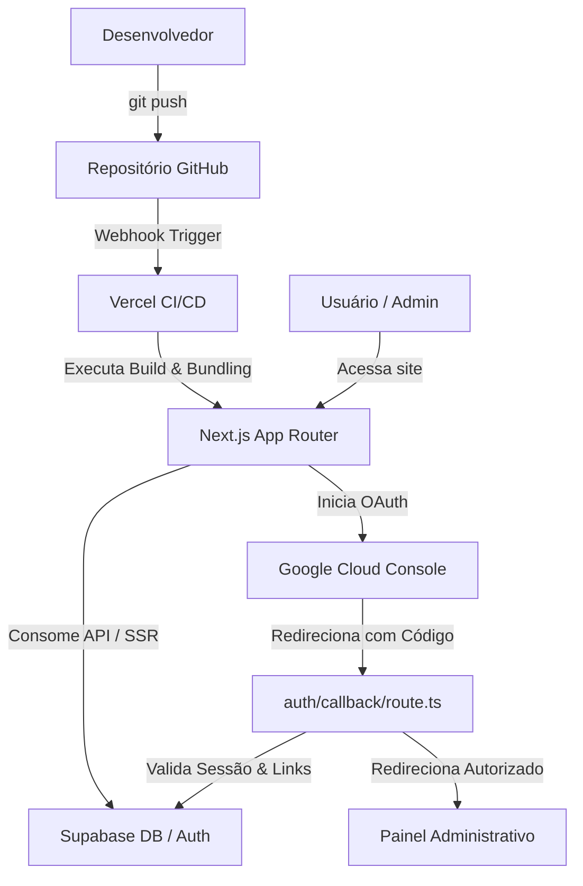

# 005-deploy.md

# Deploy Foundation

> Foundation Specification — Sprint 1

---

# Status

Planned

---

## 1. Objetivo da Foundation

O objetivo principal desta Foundation é publicar a aplicação **PM Sessions** em ambiente de produção utilizando a plataforma **Vercel**, estabelecendo o fluxo de integração contínua (CI/CD) a partir do repositório Git, e garantindo que todas as integrações com o **Supabase** e o **Google Cloud (OAuth)** estejam operacionais sob o protocolo HTTPS em ambiente remoto.

Esta etapa consolida e finaliza a **Sprint 1 (Foundations)**, entregando o ecossistema base do MVP pronto e seguro para o início do desenvolvimento das funcionalidades de negócio.

---

## 2. Escopo

### O que contempla:

- Criação e configuração do projeto na **Vercel** conectado ao repositório GitHub.
- Configuração de builds automáticos (CI/CD) vinculados à branch de produção (`master` ou `main`).
- Configuração segura das variáveis de ambiente em produção na Vercel (distinguindo escopos de cliente e servidor).
- Conexão e migração de schema do banco de dados no projeto remoto do **Supabase**.
- Configuração do **Google Cloud Console** com a URL de produção para origens e URIs de redirecionamento autorizadas do Google OAuth.
- Testes de integridade ponta-a-ponta (E2E) em ambiente de produção (registro de admin, login, RLS, middleware e logout).

### O que não contempla:

- Configuração de domínio próprio definitivo (utilizaremos o domínio gerado `.vercel.app`).
- Configuração de ambientes adicionais de Staging/Homologação (foco exclusivo em Produção).
- Implementação de ferramentas corporativas de monitoramento APM (Datadog, Sentry, etc.) e alertas automáticos.

---

## 3. Arquitetura de Deploy

A publicação da aplicação segue um modelo automatizado disparado por atualizações de código, integrando a hospedagem serveless da Vercel com a persistência do Supabase e a identidade do Google:



---

## 4. Pré-requisitos

Antes de iniciar a execução do deploy, garanta que os seguintes recursos estejam disponíveis e configurados:

- [ ] **Conta no GitHub**: Com acesso de escrita e administração ao repositório oficial do projeto.
- [ ] **Conta na Vercel**: Vinculada ou autorizada a importar repositórios da conta do GitHub correspondente.
- [ ] **Projeto Supabase Remoto**: Projeto criado e operacional no painel do Supabase com credenciais de acesso disponíveis.
- [ ] **Projeto Google Cloud**: Com a _OAuth Consent Screen_ configurada em modo de produção (ou com usuários de teste cadastrados) e as APIs de **Google Calendar** e **People API** ativas.
- [ ] **Branch Principal Definida**: Branch padrão de deploy configurada e limpa de arquivos locais ou caches não utilizados.
- [ ] **Tag do Git / Release**: Registro de tag e release da versão `v0.1.0-core-platform` criada e documentada no repositório.

---

## 5. Configuração do Projeto na Vercel

A aplicação Next.js monorepo deve ser importada na Vercel com os seguintes parâmetros operacionais:

| Configuração          | Parâmetro / Valor                    | Rationale                                                        |
| --------------------- | ------------------------------------ | ---------------------------------------------------------------- |
| **Import Repository** | Selecionar o repositório do projeto  | Vincula o repositório para deploy contínuo.                      |
| **Monorepo**          | Sim (Configuração ativa)             | Identifica a estrutura de múltiplos pacotes.                     |
| **Root Directory**    | `apps/web`                           | Define a raiz da aplicação Next.js dentro do monorepo.           |
| **Framework Preset**  | `Next.js`                            | Configura o compilador e otimizador padrão.                      |
| **Install Command**   | `pnpm install`                       | Comando executado na raiz do monorepo para baixar dependências.  |
| **Build Command**     | `pnpm --filter web build`            | Compila apenas o pacote da aplicação web Next.js.                |
| **Output Directory**  | `.next`                              | Pasta de destino dos artefatos estáticos e dinâmicos compilados. |
| **Node Version**      | `20.x` ou `22.x`                     | Versão compatível com a engine definida nos pacotes.             |
| **Auto Deploy**       | Habilitado para a branch de produção | Cada push na branch padrão gera uma nova versão publicada.       |
| **Production Branch** | `master` (ou `main`)                 | Branch que dispara o deploy oficial de produção.                 |

---

## 6. Variáveis de Ambiente

As seguintes chaves devem ser inseridas na seção **Environment Variables** do projeto na Vercel:

| Nome da Variável                | Obrigatória |       Escopo       | Descrição                                                         | Exemplo / Formato                            |
| ------------------------------- | :---------: | :----------------: | ----------------------------------------------------------------- | -------------------------------------------- |
| `NEXT_PUBLIC_APP_URL`           |   **Sim**   | Cliente e Servidor | URL base de produção gerada pela Vercel.                          | `https://pm-sessions.vercel.app`             |
| `NEXT_PUBLIC_SUPABASE_URL`      |   **Sim**   | Cliente e Servidor | URL da API do projeto Supabase remoto.                            | `https://yjyckvesjmqlvxrszown.supabase.co`   |
| `NEXT_PUBLIC_SUPABASE_ANON_KEY` |   **Sim**   | Cliente e Servidor | Chave anônima pública para requisições de cliente ao Supabase.    | `eyJhbGciOiJIUzI1NiIsInR5c...`               |
| `SUPABASE_SERVICE_ROLE_KEY`     |   **Sim**   |  Apenas Servidor   | Chave secreta de administrador (service role) para contornar RLS. | `eyJhbGciOiJIUzI1NiIsInR5c...`               |
| `GOOGLE_CLIENT_ID`              |   **Sim**   | Cliente e Servidor | ID de cliente OAuth do Google Cloud Console.                      | `868754759673-...apps.googleusercontent.com` |
| `GOOGLE_CLIENT_SECRET`          |   **Sim**   |  Apenas Servidor   | Segredo do cliente OAuth (usado internamente pelo Supabase).      | `GOCSPX-cUGsaBmBszqCcr...`                   |

> [!CAUTION]
> A chave `SUPABASE_SERVICE_ROLE_KEY` e o `GOOGLE_CLIENT_SECRET` **nunca** devem ser marcados com exposição para o cliente. Devem permanecer restritos às funções do servidor (API Routes e Server Actions) e nunca expostos no código do navegador.

---

## 7. Integração com Supabase

Após o provisionamento do projeto Supabase e publicação do frontend na Vercel:

1. **Migrações**: Executar o pipeline de migrações (`supabase/migrations/`) contra o banco de dados remoto do Supabase para refletir as tabelas `admins`, `time_slots`, `sessions` e `participants`.
2. **Políticas de RLS**: Garantir que o script de RLS e índices de performance (`20260718000001_auth_rls.sql` e `20260718000002_auth_index.sql`) sejam executados para proteger as tabelas.
3. **Persistência de Sessão**: O Middleware (`src/middleware.ts`) interceptará requisições e atualizará os cookies do navegador. A Vercel receberá e encaminhará os cabeçalhos de cookies (`Set-Cookie`) nas rotas dinâmicas (SSR) de forma transparente.

---

## 8. Integração com Google OAuth

As configurações do Google Cloud Console devem ser atualizadas para aceitar a URL oficial gerada pela Vercel:

### Google Cloud Console — Configurações OAuth:

- **Authorized JavaScript Origins**:
  - Local: `http://localhost:3000`
  - Produção: `https://<seu-projeto>.vercel.app`
- **Authorized Redirect URIs**:
  - Local: `http://localhost:3000/auth/callback`
  - Produção: `https://<seu-projeto>.vercel.app/auth/callback`

### Configuração no Supabase Dashboard:

Acesse o painel do Supabase, vá em _Authentication -> Providers -> Google_ e insira:

- **Client ID**: O ID obtido no Google Cloud Console.
- **Client Secret**: O Segredo obtido no Google Cloud Console.
- Certifique-se de habilitar o provider e salvar as alterações.

---

## 9. Fluxo Completo do Deploy

```text
1. Git Push (Master) ──────> Dispara webhook de compilação na Vercel
                                 │
2. Build e Compilação ◄────── Executa "pnpm --filter web build"
                                 │
3. Setup de Variáveis ◄────── Vercel injeta as ENVs de Produção
                                 │
4. Migrações no DB ────────── Supabase CLI ou SQL Editor aplica o Schema + RLS no banco remoto
                                 │
5. Link de Domínio ────────── Vercel ativa o domínio HTTPS ".vercel.app"
                                 │
6. Teste de Acesso ────────── Validação manual das rotas /login, /logout e Dashboard
```

---

## 10. Testes Pós-Deploy

Uma vez concluído o deploy, execute a seguinte lista de verificação em produção para assegurar a saúde e integridade do ecossistema:

- [ ] **HTTPS Ativo**: A aplicação redireciona automaticamente HTTP para HTTPS com certificado válido.
- [ ] **Página Inicial**: A tela de login (ou landing page) carrega em menos de 2 segundos.
- [ ] **Autenticação Google**: Clicar em "Entrar com o Google" abre a tela de consentimento do Google sob o domínio de produção.
- [ ] **Callback OAuth**: O callback é processado, realiza o bootstrap do `auth_user_id` em `public.admins` e redireciona.
- [ ] **Middleware**: Tentar acessar `/admin/dashboard` sem autenticação redireciona para `/login`.
- [ ] **Acesso Direto**: Acessar `/login` estando autenticado redireciona para `/admin/dashboard`.
- [ ] **Logout**: Acessar `/logout` limpa os cookies locais e redireciona para `/login`.
- [ ] **Divergência de IDs**: Tentar autenticar com uma conta cujo ID de auth difere do cadastrado gera erro controlado (`/login?error=unauthorized`) e loga o aviso de segurança.
- [ ] **Persistência E2E**: Fechar a aba do navegador e reabrir preserva a sessão do administrador logado.

---

## 11. Troubleshooting

Abaixo estão descritos os problemas mais comuns encontrados durante a fase de publicação e as respectivas soluções de contorno:

### 1. Google OAuth: `redirect_uri_mismatch`

- **Sintoma**: Ao tentar logar, o Google exibe uma tela de erro informando que a URI de redirecionamento é inválida.
- **Causa**: A URL de callback de produção (`https://<projeto>.vercel.app/auth/callback`) não foi adicionada no campo _Authorized Redirect URIs_ no Google Cloud Console ou o redirect configurado no Supabase aponta para a URI antiga de localhost.
- **Solução**: Verifique o Google Cloud Console e certifique-se de que a URI exata (incluindo HTTPS) está registrada e coincide com a URL cadastrada no Supabase e no `NEXT_PUBLIC_APP_URL`.

### 2. Middleware: `Redirect loop detected`

- **Sintoma**: O navegador exibe erro de excesso de redirecionamentos ao tentar acessar `/login` ou `/admin/dashboard`.
- **Causa**: O `matcher` do middleware não está excluindo corretamente arquivos estáticos e de mídia, ou a lógica de checagem de usuário e rotas entra em conflito.
- **Solução**: Verifique a constante `ROUTES` em `shared/config/routes.ts` e certifique-se de que `/login` não é considerado uma rota protegida e `/admin` não é considerada uma rota pública de autenticação.

### 3. Build na Vercel falha por falta de ENVs

- **Sintoma**: O log de build da Vercel exibe erros de variáveis ausentes ao compilar arquivos de configuração.
- **Causa**: Variáveis usadas em tempo de build não foram inseridas ou não possuem fallback.
- **Solução**: Verifique se a verificação de ambiente em `config.ts` retorna a string `'placeholder'` durante o build de produção (`NODE_ENV === 'production'`) para passar pelas validações estáticas do compilador do Next.js.

---

## 12. Segurança

Durante o processo de deploy, a preservação do sigilo de chaves e o controle de acesso de dados devem obedecer a boas práticas rigorosas:

- **Segregação de Privilégios**: Nunca utilize a chave `service_role` em componentes de cliente ou páginas que rodam no navegador.
- **Auditoria de Git**: Certifique-se de que nenhum arquivo `.env` local foi versionado. Utilize o comando `git status` antes de gerar a release.
- **Segurança de Cookies**: Os cookies criados pelo Supabase SSR em produção devem possuir as flags `HttpOnly`, `Secure` e `SameSite=Lax` (ou `Strict`) habilitadas automaticamente para proteção contra ataques XSS e CSRF.

---

## 13. Critérios de Aceite

O deploy será considerado homologado quando:

- [ ] A aplicação web Next.js buildar na Vercel sem erros estáticos ou avisos de compilação.
- [ ] A aplicação estiver acessível publicamente via HTTPS sob o domínio da Vercel.
- [ ] O fluxo de login administrativo via Google OAuth funcionar ponta-a-ponta em produção.
- [ ] Usuários não autorizados (emails que não constam em `public.admins`) forem rejeitados.
- [ ] A sessão do administrador for mantida após atualizações de página (F5).
- [ ] O logout limpar completamente as credenciais de sessão locais.

---

## 14. Resultado Esperado

Ao final desta Foundation, o ecossistema do **PM Sessions** estará publicado e disponível na web. Os administradores do sistema conseguirão se logar com segurança a partir de qualquer dispositivo utilizando suas contas corporativas do Google, acessando o painel de forma segura e auditável, com todas as políticas de segurança de dados (RLS) plenamente ativas no banco de dados Supabase em produção.

---

## 15. Histórico de Execução

Esta seção registra as tentativas e execuções oficiais de deploy da aplicação:

| Data | Responsável | Ambiente | Resultado | Observações |
| ---- | ----------- | -------- | --------- | ----------- |
|      |             |          |           |             |
