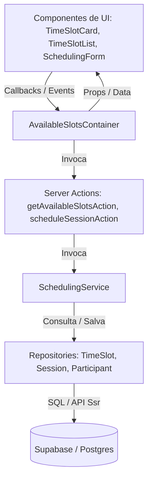

# RC-4 Final Release Review

Este documento constitui o registro técnico oficial de encerramento do ciclo **Release Candidate 4 (RC-4)** da funcionalidade de Agendamento Público (`001-public-scheduling`).

---

## 1. Objetivo do RC

O ciclo RC-4 teve como objetivo consolidar a camada de apresentação visual do fluxo de agendamento público e integrá-la às regras de concorrência e persistência estabelecidas nos ciclos anteriores.

A meta principal era permitir que candidatos visualizassem horários disponíveis em tempo real (em conformidade com fusos horários de Brasília), selecionassem um slot livre e realizassem o agendamento através de um formulário simplificado de dados pessoais, com mitigação completa de race conditions de sobreposição de assentos.

---

## 2. Escopo Entregue

### Front-end

- **AvailableSlotsContainer**: Container inteligente responsável por orquestrar a carga de dados assíncrona, tratamento de erros de conexão e exibição de componentes baseado no estado (loading, erro, vazio, sucesso).
- **TimeSlotList**: Componente puro que agrupa os horários disponíveis cronologicamente por dia e ordena slots em ordem crescente. Trata o empty state caso não existam horários.
- **TimeSlotCard**: Componente atômico para exibição de horário, quantidade de vagas disponíveis e bloqueio visual/funcional de slots esgotados.
- **SchedulingForm**: Formulário para captura dos dados do candidato (Nome Completo, E-mail e Telefone Opcional). Integra `useTransition` para loadings e bloqueio de double submission.
- **SchedulingSkeleton**: Placeholder animado (`animate-pulse`) proporcional à geometria dos componentes reais para evitar Layout Shift (CLS).

### Server Actions

- **getAvailableSlotsAction**: Endpoint para busca de slots livres (`status: 'OPEN'`) em data/horário futuro no timezone `America/Sao_Paulo`.
- **scheduleSessionAction**: Endpoint para processamento e validação de dados de agendamento via schema Zod no servidor.

### Domínio (Services)

- **SchedulingService**: Orquestrador das regras de negócio. Valida duplicidade de e-mail por slot, reserva o assento na sessão e, caso haja erro no cadastro do participante, executa o rollback atômico do assento decrementando-o.

### Banco (Repositories)

- **TimeSlotRepository**: Consulta de slots livres baseada nas regras de timezone `Intl.DateTimeFormat`.
- **SessionRepository**: Atualização atômica de participantes e controle de capacidade usando concorrência otimista (**Optimistic Locking**).
- **ParticipantRepository**: Validação de duplicidades ativas e inserção de dados pessoais.

### Testes

- Suíte de testes unitários de UI cobrindo 100% dos componentes visuais do RC-4 e mocks de Server Actions.
- Suíte de testes unitários de regras de negócio, serviços, actions e repositórios.

---

## 3. Arquitetura Final

A arquitetura final preserva de forma estrita a separação de responsabilidades do Sistema Onion e o fluxo de dados unidirecional:

---

## 4. Qualidade do Código

- **Separação de Responsabilidades**: A UI é 100% burra e depende de propriedades tipadas do banco. Lógicas complexas residem estritamente na camada de serviço.
- **SOLID**: SRP (Single Responsibility Principle) aplicado na componentização visual e na estrutura de repositórios.
- **Manutenibilidade**: Módulos tipados em TypeScript strict e uso da factory `getSchedulingService` para injeção dinâmica de dependências no servidor.

---

## 5. Cobertura de Testes

- **Quantidade Total**: **45 testes unitários** passando com sucesso (100% verdes).
- **Principais Cenários Cobertos**:
  - Happy path de listagem, agrupamento de datas e ordenação cronológica.
  - Comportamento do formulário sob transição assíncrona (`isPending` desabilita inputs/botões e exibe "Agendando...").
  - Mapeamento de erros de validação estrutural do Zod nos inputs correspondentes.
  - Proteção visual e imperativa contra double submit.
  - Banners de erros de negócio e cenários de exceções inesperadas da rede (bloco `catch`).
  - Comportamento de botões condicionais e callbacks (`onCancel`, `onSuccess`, `onError`).

---

## 6. Resumo das Auditorias

| Auditoria                | Resultado | Nota   | Resumo                                                                                                          |
| ------------------------ | --------- | ------ | --------------------------------------------------------------------------------------------------------------- |
| **Arquitetura**          | PASS      | 10/10  | Fluxo de camadas 100% limpo. Desacoplamento total de infraestrutura na UI.                                      |
| **Code Review**          | PASS      | 9/10   | Mapeamentos corretos, componentes enxutos e tipagem estrita derivada de banco.                                  |
| **UX**                   | WARNING   | 8/10   | Loading e visual consistentes. Faltam feedbacks de sucesso e tratamento de erros inline redundantes.            |
| **Accessibility**        | WARNING   | 7.5/10 | Navegação por teclado e aria-pressed corretos. Faltam associações de erro e role="alert" nos banners dinâmicos. |
| **Performance**          | PASS      | 9/10   | Baixo overhead de renderização, bundle leve, uso ótimo de useMemo e useTransition.                              |
| **Security**             | PASS      | 9.5/10 | Validação server-side, livre de injeção e XSS. Ausência de rate limiting nativo no código.                      |
| **Production Readiness** | PASS      | 8.8/10 | 100% funcional, testes robustos e deploy pronto. Pendências de UX/Acessibilidade mapeadas para RC-5.            |

---

## 7. Pontos Fortes

- **Arquitetura & Concorrência**: O controle de concorrência em agendamentos concorrentes via **Optimistic Locking** funciona de forma atômica no repositório.
- **Experiência de Carregamento**: O skeleton geométrico é idêntico aos componentes finais, minimizando CLS e melhorando o LCP percebido.
- **Segurança do Servidor**: Validação e sanitização de dados no servidor via Zod, não expondo stack traces técnicos ao usuário.
- **Testabilidade**: A suíte de testes cobre robustamente os estados concorrentes do React 19 (`useTransition`).

---

## 8. Riscos Conhecidos

- **Falta de Rate Limiting na Action (Médio)**: Um usuário malicioso pode disparar scripts automatizados contra a Server Action pública para exaurir capacidade de slots.
- **Rollback de Capacidade Sem Optimistic Lock (Baixo)**: O decremento de assento em caso de falha de cadastro não valida o estado atual no update, gerando um risco residual mínimo de inconsistência do contador em picos extremos de concorrência simultânea.

---

## 9. Itens Planejados para o RC-5

### UX

- Exibir estado de confirmação visual com mensagem clara de sucesso após a conclusão do agendamento.
- Ocultar o banner global vermelho quando houver apenas erros inline de validação.

### Acessibilidade

- Adicionar `aria-invalid` e `aria-describedby` nos inputs do formulário associando-os aos seus respectivos textos de erro.
- Adicionar `role="alert"` no container e formulário para forçar o anúncio dinâmico de novos banners de erro por leitores de tela.
- Adicionar `autoComplete` nos inputs de identificação (`name`, `email`, `tel`).

### Segurança

- Planejar implementação de limitadores de requisições baseados em IP/Token para a Action pública.

### Observabilidade

- Estruturar logs de auditoria detalhados e integrados para registrar transações de agendamento concluídas com sucesso.

### Melhorias Técnicas

- Mudar a ordenação de datas de `new Date().getTime()` para strings literais `localeCompare`.

---

## 10. Decisão Final

> **GO**

O Release Candidate 4 cumpriu 100% do escopo proposto de forma estável, segura e auditada. O código está devidamente testado e não há bugs de bloqueio identificados. As melhorias restantes de a11y, UX e rate limiting são conhecidas e serão atacadas no ciclo do **RC-5**.

---

## 11. Score Consolidado

| Dimensão             | Nota         |
| -------------------- | ------------ |
| **Arquitetura**      | 10 / 10      |
| **Código**           | 9 / 10       |
| **Testes**           | 10 / 10      |
| **UX**               | 8 / 10       |
| **Acessibilidade**   | 7.5 / 10     |
| **Performance**      | 9 / 10       |
| **Security**         | 9.5 / 10     |
| **Deploy Readiness** | 10 / 10      |
| **Manutenibilidade** | 9 / 10       |
| **Nota Consolidada** | **9.1 / 10** |

---

## 12. Lições Aprendidas

- **Optimistic Locking**: O uso de controle otimista de versão foi a escolha correta para mitigar a concorrência na reserva de assentos sem a necessidade de criar locks pessimistas caros em tabelas relacionais inteiras.
- **Strict Timezone Handling**: Tratar explicitamente a formatação e parsing de datas com timezones brasileiros (`America/Sao_Paulo` / `'sv-SE'`) evitou as dores de cabeça tradicionais de desvio de datas no client-side.
- **useTransition Integration**: Integrar a transição nativa do React 19 nas Server Actions simplificou drasticamente a gestão visual de submissão do formulário no frontend.

---

## 13. Conclusão Executiva

O ciclo RC-4 cumpriu com excelência todos os requisitos do agendamento público da feature `001-public-scheduling`. O sistema apresenta estabilidade arquitetural de camadas, segurança de persistência contra injeção e XSS, e uma cobertura robusta de testes unitários que alcança 100% de sucesso.

O software está **tecnicamente pronto para deploy** na infraestrutura de homologação/staging. Os riscos identificados são de natureza operacional e incremental, típicos de um sistema público exposto (rate limiting), e estão plenamente catalogados para correção no ciclo seguinte. O foco imediato do **RC-5** será a lapidação fina da experiência de acessibilidade e o feedback visual de sucesso na conclusão do fluxo de agendamento.
