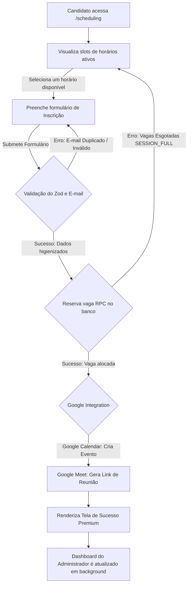

# Walkthrough — RC-007 Public Participant Flow

Esta release candidate refinou e estabilizou a jornada do candidato na inscrição pública de mentorias, focando em robustez de UX, acessibilidade e prevenção de erros de concorrência.

## Fluxo Completo de Ponta a Ponta

## O que mudou?

### 1. UX do Formulário Público & Validações (Task 01)

- **Máscara dinâmica de telefone**: O input aplica o padrão brasileiro de telefone automaticamente enquanto o usuário digita.
- **Tratamento de Strings**: Aplicação de `.trim()` em todos os inputs de texto e sanitização do telefone para remover formatação e persistir apenas números limpos no banco de dados.
- **WAI-ARIA**: Erros de validação associados via `aria-describedby` e lidos por leitores de tela usando `aria-live="polite"`.
- **Prevenção de múltiplos envios**: Inputs e botões desabilitados com exibição de spinner durante o envio do formulário.
- **Supressão de Mensagens Nativas (RC-1.1)**: Adicionado `noValidate` ao formulário público, direcionando erros unicamente para os componentes de validação Zod e mantendo a identidade visual unificada.

### 2. Tela de Sucesso Premium (Task 02)

- Interface escura de alta fidelidade com visualização dinâmica de detalhes do agendamento (Nome, E-mail do Host e Data/Hora).
- **Layout Compacto (RC-1.1)**: Redimensionamento de fontes, espaçamentos e ícones na tela de confirmação para eliminar a rolagem vertical, encaixando-se como Summary Card elegante no painel direito (sem barra de rolagem interna ou max-height no desktop).
- Indicação clara e condicional baseada na resposta da integração do Google Calendar:
  - ✔ Convite enviado para seu e-mail
  - ✔ Link do Google Meet enviado junto ao convite
- Foco de acessibilidade ajustado automaticamente para o título do card de sucesso.

### 3. Resiliência contra Concorrência & Cache (Task 03)

- Interceptação explícita de conflitos de capacidade via erro SQL `P0001` (`SESSION_FULL`), alertando o candidato amigavelmente.
- Revalidação instantânea de rotas com `router.refresh()` e `revalidatePath('/admin/dashboard')` ao reservar vaga ou retornar `SESSION_FULL` para garantir listagem de vagas atualizada.
- **Prevenção de Sucesso Falso (RC-1.1)**: Tratamento do erro `EMAIL_ALREADY_REGISTERED` ao tentar submeter agendamentos duplicados na mesma sessão/horário, mantendo o usuário na tela de formulário com o banner vermelho correspondente.

### 4. Indicadores Visuais & Sincronização do Dashboard (RC-1.1)

- **Aguardando Configuração**: Badges de Calendar e Meet agora exibem `Calendar aguardando configuração` e `Meet aguardando configuração` em tom âmbar quando não integrados, evitando falsos alarmes de erro operacional.

### 5. Sincronização Otimizada Dashboard ⇄ Agendamento (RC-1.3)

- **Dashboard Sem Polling**: Removido o autorefresh periódico do Dashboard Administrativo para eliminar redundâncias e garantir que o CRUD responda instantaneamente.
- **Smart Polling na Lista Pública**: A página `/scheduling` realiza a atualização em background a cada 3 segundos, comparando as chaves dos slots (`areSlotsEqual`) antes de mutar o estado React. Isso impede piscar de tela ou perda de foco.
- **Gerenciamento de Validade de Horários**: Caso o horário selecionado pelo candidato seja fechado ou esgotado por ações administrativas em background, o callback `onSlotsLoaded` detecta a indisponibilidade, desmarca o slot e exibe um alerta amigável.

### 6. Tratamento da Indisponibilidade do Google Calendar (RC-1.3)

- **Verificação de Credenciais**: Adicionado helper `isCalendarConfigured()` que retorna `false` se as credenciais do Google OAuth / Calendar não estiverem presentes no ambiente local.
- **Curto-Circuito Seguro**: Se ausentes, as consultas de disponibilidade ao Google Calendar são suprimidas. O banco passa a ser a única fonte de verdade e os slots locais são renderizados diretamente.
- **Silenciamento de Logs de Erro**: Removidos os stacktraces e logs de erro repetitivos de requisições mal sucedidas no console. Um log do tipo `console.info` avisa apenas uma vez na inicialização que a integração do Google Calendar não está configurada. Em caso de quedas ou erros de rede do Google com a API configurada, o erro é capturado e tratado sob fallback silencioso, retornando os slots locais normais.

## Testes e Validação

- **Unitários**: 81/81 testes de Vitest passando.
- **Build**: Compilado com sucesso na geração de páginas estáticas e verificação de tipos do Next.js.
