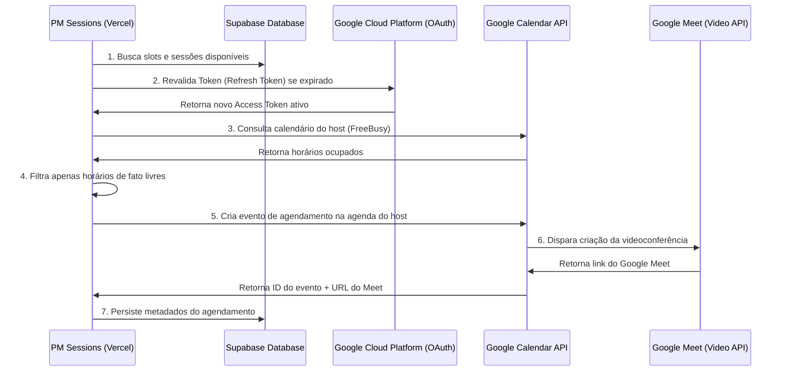

# Overview da Integração de Infraestrutura Google Workspace

## Visão de Negócio

Para que o PM Sessions funcione de forma automatizada e profissional, o fluxo de agendamento de sessões de mentoria precisa estar diretamente conectado à agenda real dos mentores (hosts) e gerar salas virtuais dinâmicas de reuniões.

Esta RC-008 documenta a infraestrutura necessária para transicionar o PM Sessions de credenciais mockadas/dev para credenciais de produção reais do Google Cloud Platform (GCP).

## Arquitetura de Comunicação

---

## Detalhamento de Plataformas e Configurações

A implantação desta infraestrutura envolve três pilares principais: **Google Cloud Console**, **Google Admin Workspace** (se aplicável para hosts institucionais) e **Vercel Console (Environment Variables)**.

### 1. Google Cloud Console

- **Projeto dedicado**: Criação ou definição de um projeto Google Cloud isolado para o PM Sessions.
- **APIs Ativadas**:
  - `Google Calendar API`
  - `Google Meet API` (se for necessário ativá-la separadamente sob o escopo do Workspace)
- **Tela de Consentimento OAuth**:
  - Tipo de Usuário: _Interno_ (se restrito à organização corporativa/Google Workspace institucional) ou _Externo_ (para qualquer conta do Gmail).
  - Escopos necessários:
    - `https://www.googleapis.com/auth/calendar` (Leitura e gravação na agenda primária dos hosts).
    - `https://www.googleapis.com/auth/calendar.events` (Criação, edição e exclusão de eventos específicos).
- **Credenciais**:
  - Criação de um ID de cliente OAuth 2.0 (Tipo: _Aplicativo da Web_).
  - Definição de URIs de redirecionamento autorizados:
    - Localhost (Dev): `http://localhost:3000/auth/callback`
    - Produção (Prod): `https://<seu-dominio-prod>.vercel.app/auth/callback`

### 2. Fluxo OAuth Offline & Geração do Refresh Token

- Para que a aplicação possa ler e editar o calendário em segundo plano (em Server Actions e polling em background) sem exigir login repetitivo dos hosts, as credenciais precisam solicitar acesso offline (`access_type: 'offline'`) e forçar a tela de consentimento (`prompt: 'consent'`).
- O Token de Atualização (`GOOGLE_REFRESH_TOKEN`) gerado no primeiro login administrativo será copiado e configurado em produção. Ele expira apenas se for revogado pelo administrador ou se o app ficar inativo/em teste por mais de 100 dias (no caso de consentimento em modo Sandbox).

### 3. Vercel Console (Produção)

- Configuração das seguintes variáveis de ambiente (Secrets) para que o Next.js se conecte de forma transparente à produção:
  - `GOOGLE_CLIENT_ID`
  - `GOOGLE_CLIENT_SECRET`
  - `GOOGLE_REFRESH_TOKEN`
  - `GOOGLE_CALENDAR_ID` (Geralmente `primary` ou o ID de uma agenda compartilhada).

---

## Critérios de Homologação

Para certificar que a infraestrutura está 100% configurada e operando de forma correta e resiliente, o administrador/engenheiro responsável deverá validar os seguintes fluxos:

1. **Validação de Cadastro de Eventos**: Disparar uma inscrição na página pública e verificar se um convite real do Google Calendar é criado instantaneamente no e-mail do host.
2. **Link do Google Meet**: Validar se o convite do Calendar possui o link funcional gerado do Google Meet (`meet.google.com/...`) associado.
3. **Bloqueio de Horário (FreeBusy)**: Criar um evento pessoal manualmente no calendário do host e verificar se o polling na página pública do PM Sessions oculta/bloqueia esse horário automaticamente em até 3 segundos.
4. **Resiliência a Token Expirado**: Interceptar a requisição e validar se a aplicação renova o token automaticamente utilizando o `GOOGLE_REFRESH_TOKEN` configurado nas variáveis de ambiente.
